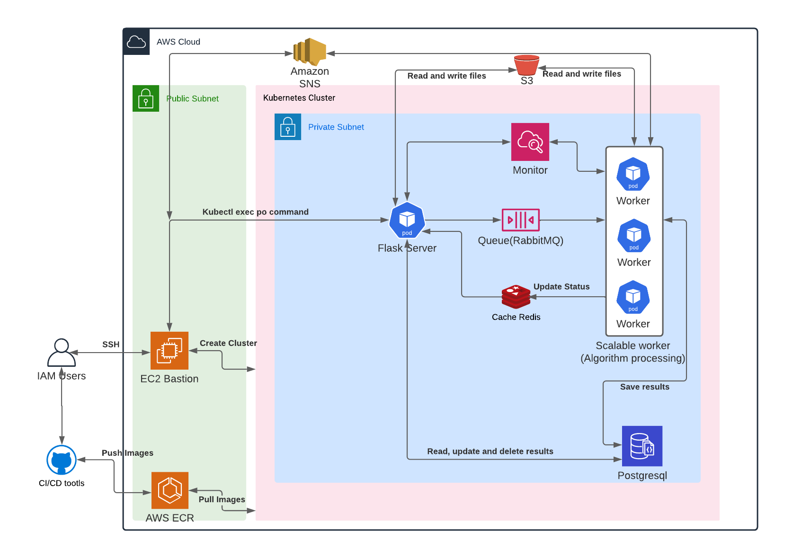

# gismo-cloud-deployment

<table>
<tr>
  <td>Latest Release</td>
</tr>
<tr>
  <td>License</td>
</td>
</tr>
<tr>
  <td>Build Status</td>
</tr>
<tr>
    <td>Code Quality</td>
</tr>
<tr>
    <td>Test-Coverage</td>
</tr>
</table>

Tools for performing multiple common tasks on solar PV data signals by running various EC2 instances in parallel on the AWS EKS platform.

---

## Install & Setup

### Quick start on AWS

1. Login to `slac-gismo` AWS account.
2. Go to `EC2` page in `us-east-2` region and select `AMIs` in `Images` tab in left option menu.
3. Select the template called `pvinsight-eks-bastion-template` from AMIs private image and click `Lunach instance from AMIs`.
This image had been installed necessary dependenciues included:
- [kubectl](https://docs.aws.amazon.com/eks/latest/userguide/install-kubectl.html)
- [eksctl](https://docs.aws.amazon.com/eks/latest/userguide/eksctl.html)
- [awscli](https://docs.aws.amazon.com/cli/latest/userguide/getting-started-install.html)
- [git](https://git-scm.com/) 
- [docker](https://docs.docker.com/)
- [docker-compose](https://docs.docker.com/compose/install/)
- [gismo-cloud-deploy project](https://github.com/slacgismo/gismo-cloud-deploy) 

#### Launch instance notes

- **_NOTE:_** This program runs in multiple threads. Therefore, please select at least `2 vcpus` instance type.  Under `Instance types`, select `t2.large` type is recommended.

- **_NOTE:_** Under `Configure Storage`, select the volume of the instance should be `12 GB` at least.

- **_NOTE:_** Under `Key pair(login)` option, create a new key pair or use your existing key pair.

- **_NOTE:_** Click `Lunach instance` button to lanch a EC2 instance.

- **_NOTE:_** After the EC2 instance is launched, under the `Tags`, create a tag called: `project:pvinsight` for budget management purpose.

1. Once the EC2 instance is running, use your ssh key to connect to the EC2 tunnel in your local terminal. Get the ip address from the `Public IPv4 address` in `Detail` tabs

Change `pem-file` permission.

```bash
cd /path-of-pem-file
chmod 400 <pem-file>
```

```bash
ssh -i <path/pem-file> ec2-user@<Public IPv4 address>
```

2. Once inside the instance, set up AWS credential to access EKS and ECR. **_NOTE:_** `(Reach out this project's owner to get the AWS credentials).`

```bash
$ aws configure
```

~~~
AWS Access Key ID : 
AWS Secret Access Key: 
Default region name: 
Default output format [None]: 
~~~

3. Check if aws credentials are vaild by listing aws s3 bucket command.
   
``` bash
aws s3 ls
```

4. Change directory to `gismo-cloud-deploy`. Pull down latest `main` repository from [gismo-cloud-deploy.git](git@github.com:slacgismo/gismo-cloud-deploy.git), and run `git pull` command.
  
5. Set up .env files for `cli` program usage.

```bash
touch ./gismoclouddeploy/services/cli/.env
```

Below are the sample variables in the .env file, and replace `<your-aws-key>` with the correct keys.
~~~
AWS_ACCESS_KEY_ID=<your-aws-access-key-id>
AWS_SECRET_ACCESS_KEY=<your-aws-secret-access-key-id>
AWS_DEFAULT_REGION=<your-aws-default-region>
SQS_URL=<your-sqs-url>
SQS_ARN=<your-sqs-arn>
SNS_TOPIC=<your-sns-topic>
~~~

6. The AMIs image should have pre-install all the python3 dependencies of `cli` in the environment.
In case users need to re-install the dependencies of `cli`. Please follow the below command:

- The python virtual environemnt was created Create virutal environment.

- Activate the virtual environment.
  
```bash
source ./venv/bin/activate
```

- Upgrade pip

```bash
pip install --upgrage pip
```

- Update dependencies.

```bash
pip install -r requirements.txt
```

- **_NOTE:_** If virtual environment was not created, please create the virtual environemnt first.
  
```bash
cd ./gismoclouddeploy/services/cli
```

```bash
python3.8 -m venv venv
```

Upgrade pip

```bash
pip install --upgrage pip
```

Install dependencies

```bash
pip install -r requirements.txt
```

- Install python dependencies

```bash
(venv)$ pip install -r requirements.txt
```

- install pysetup

```bash
pip install e .
```

1. To run the program in `AWS` environment using `EKS` services, please make sure the environment settings in `./gismoclouddeploy/config/config.yaml` are defined below.

~~~
  environment: "AWS"  
  container_type: "kubernetes"  
  container_name: "webapp"    
~~~

8. Under the virutal environemnt, run `process first file in defined bucket and delete nodes after processing` command.

```bash
(venv)$ gcd run-files -n 1 -d 
```

---

### Command

The gcd command supports the following subcommands:


#### Process files command

```bash
(venv)$ gcd run-files [ --number | -n ] <0 ~ number> [ --deletenodes | -d ] [ --configfile | -f ] <filename> [--help]
```

* If process file command with no option command `-n`. The program will process the defined files in the `config.yaml` file.

* The process file command with option command`-n` followed with an `integer number` will process the first `number` files in the defined bucket.
If `number=0`, it processes all files in the buckets.

* The process file command with option command`-n` and an `integer number` will process the first `number` files in the defined bucket. If `number=0`, it processes all files in the buckets.

* The option command `[ --configfile | -f ] [filename]` allows users to import configuration yaml files under `gismoclouddeploy/services/cli/config` folder.
If this optional command is not assigned, the default configure file is `gismoclouddeploy/services/cli/config/config.yaml`.

Examples:

```bash
(venv)$ gcd run-files -n 1 -d -f test_config.yaml
```

The above command processes the bucket's `first 1` file defined in the `test_config.yaml`.  
Since the `-d` option command is assigned, all of the EKS nodes will be deleted after processing.

#### Other support command

- gcd --help
- gcd nodes-scale [integer_number] [--help]
- gcd check-nodes [--help]
- gcd read-dlq  [-e] [--help]
- gcd processlogs [--help]

The `nodes-scale` command allows developers to scale up or down the eks nodes.

The `check-nodes` command allows developers to check current nodes number.

The `read-dlq` command allows developers to check current nodes number. The `-e` option commmand enables or disables deleting messages after invoking this command.
The default value is `False`.

The `processlogs` command processes `logs.csv` files on AWS and draws the gantt plot in local folder.

The above command invokes function to process the first `1` file in the bucket defined in `gismoclouddeploy/services/cli/config/test_config.yaml` file.
The optional command `-d False` will disable deleting the eks nodes action after processing the files.

---

### Configuration files

Under `gismoclouddeploy/services/cli` folder, developers can modify parametes of the cli command tool.

1. The `general` configuration contains all the environement variables settings.
2. The `file-config` configuration contains all the config settings of run multiple files.
3. The `solardata` configuration contains all the parameters of solar-data-tools algorithm.
4. The `aws_config` configuration contains basic eks settings. Developers can defined number of nodes in EKS.
5. The `k8s_config` configuration contains basic kubernetes setting. Developers can define the replicas of worker in this files instead of modifying the `worker.deployment.yaml`.

### Kubernetes yaml files

All kubernetes deployment and service files are listed under `gismoclouddeploy/services/cli/k8s/k8s-aws` and `gismoclouddeploy/services/cli/k8s/k8s-local` folder. Developers can modify as their need.

### EKS configration yaml files

The create cluster command will create a eks cluster based on the configuration file in `cluster.yaml`.

```bash
make create-cluster
```

If user create cluster throug the `create-cluster` command based on the `cluster.yaml`. 
It's recommended to delete cluster through `delete-cluster`command based on the `cluster.yaml` file to avoid issue on AWS.  

```bash
make delete-cluster
```

---

### Build and push images on AWS.

The AWS EKS hosts services based on the ECR images. If developers modify any code inside the server folder, developers have to build and push new images to ECR to see the changes.

To build new images to be used by Kubernetes, developers have to build and test images by docker-compose command. If the images are verified, developers can push images to ECR.

1. Build `worker` and `webapp` images through `docker-compose` command.

```bash
cd gismoclouddeploy/services
docker-compose build
```

2. Login to ECR and get validation

```bash
make ecr-validation
```

3. push `worker` and `webapp` to ECR
```bash
make push-all
```

4. Check k8s status by command:

```bash
kubectl get all
```

If kubernetes services are running, developers should see the following output in the terminal.

- **_NOTE:_** Since the eks node number is 0, the terminal output shows `0/1 READY` as below.

```bash
NAME                       READY   UP-TO-DATE   AVAILABLE   AGE
deployment.apps/rabbitmq   0/1     1            0           20h
deployment.apps/redis      0/1     1            0           20h
deployment.apps/webapp     0/1     1            0           20h
deployment.apps/worker     0/1     1            0           20h
```

If no k8s config files had been apply, please apply k8s yaml files by command:

```bash
cd gismoclouddeploy/services/cli/k8s/k8s-aws
kubectl apply -f .
```

If `worker` and `webapp` images had been applied. Developers can rollout and restart image by command:

```bash
make rollout
```

---

### Setup, build and push image in the local machine

#### local Installation

1. Download git repository

```bash
git clone https://github.com/slacgismo/gismo-cloud-deploy.git
```

2. Install the dependencies

```bash
cd gismo-cloud-deploy/services/cli
python3 -m venv venv
source ./venv/bin/activate
pip install -r requirements.txt
```

3. Developers are allowed to use `docker-compose` or `kubernetes` to manage the system locally.

#### Using docker-compose

Before using docker to host local services, please install docker by the following instructions [Docker Link](https://docs.docker.com/get-docker/).

Developers are allowed to run `gcd` command in the local environment through docker services instead of kubernetes.

In `config.yaml` file, change the following settings below to run the program through docer services.

~~~
  environment: "local"  
  container_type: "docker"  
  container_name: "web"    
~~~


#### Include MOSEK licence to build docker image

 MOSEK is a commercial software package. The included YAML file will install MOSEK for you, but you will still need to obtain a license. More information is available here:

* [mosek](https://www.mosek.com/resources/getting-started/)
* [Free 30-day trial](https://www.mosek.com/products/trial/)
* [Personal academic license](https://www.mosek.com/products/academic-licenses/)

Include `MOSEK` licence file `mosek.lic` under folder `./gismoclouddeploy/services/server/licence`. The licence file is required to build docker images.

Running docker images by command

```bash
cd gismo-cloud-deploy/gismoclouddeploy/services
docker-compose up --build
```


---

#### Using local Kubernetes

In `config.yaml` file, change the following settings below to run the program through local kubernetes services.

~~~
  environment: "local"  
  container_type: "kubernetes"  
  container_name: "webapp"    
~~~


Once the docker images were build. Apply `kubernetes` setting in `./gismoclouddeploy/services/cli/k8s/k8s-local` folder by command.

```bash
$ kubectl apply -f .
```

#### Push to AWS ECR

Setup AWS credentials

```bash
$ aws configure
```

Login AWS ECR

```bash
$ cd ./gismoclouddeploy/services
$ make ecr-validation
```

Push images to ECR
```bash
$ make push-all
```
---

### Testing

### Test cli

Run pytest coverage in cli

```bash
$ cd ./gismoclouddeploy/services/cli
$ pytest --cov=.
```

#### Test docker image

Run pytest in docker image

```bash
$ docker-compose exec web pytest 
```

Get test coverage in docker image

```bash
$ docker-compose exec web pytest --cov=.
```

---

### EKS auth setting

Once the EKS cluster is created, only the user who makes this EKS cluster has permission to access it. In order to add other users permission into this cluster, two methods are listed below to setup permissions.

method 1:

```bash
$ eksctl create iamidentitymapping --cluster  <clusterName> --region=<region> --arn arn:aws:iam::123456:role/testing --group system:masters --username admin
```

method 2:

```bash
$ kubectl edit configmap aws-auth -n kube-system
```

change the config file as:
~~~
mapUsers: |
  - userarn: arn:aws:iam::[account_id]:root
    groups:
    - system:masters
~~~
---

### System diagram


## Usage

## Contributors


## Test Coverage

## Versioning

We use [Semantic Versioning](http://semver.org/) for versioning. For the versions available, see the [tags on this repository].

## Authors

## License

This project is licensed under the BSD 2-Clause License - see the [LICENSE](LICENSE) file for details


