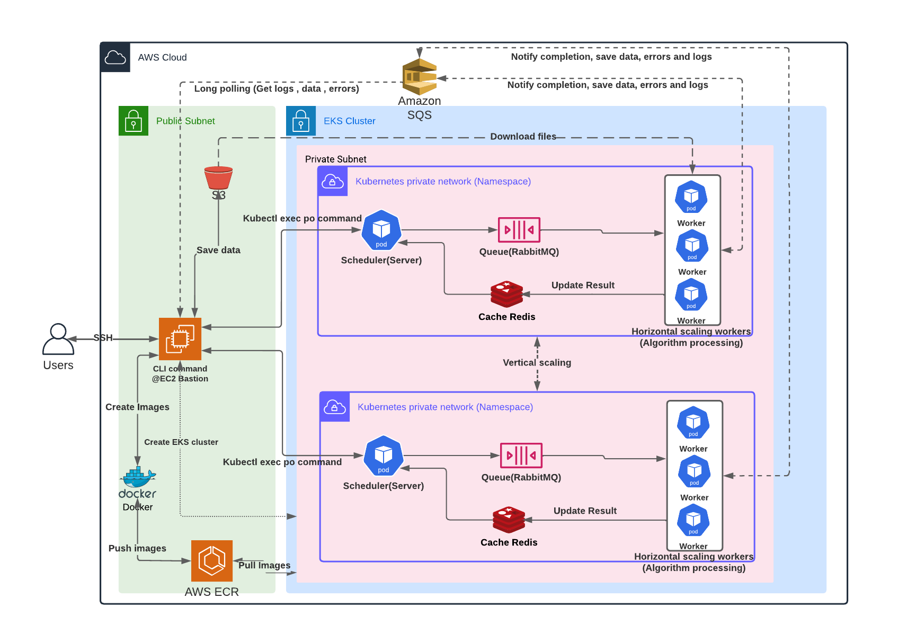

# Gismo-Cloud-Deployment

<table>
<tr>
  <td>Latest Release</td>
  <td>
    <a href="https://img.shields.io/github/v/release/slacgismo/gismo-cloud-deploy?include_prereleases">
        
    </a>
    <a href="https://github.com/slacgismo/gismo-cloud-deploy/tags">
        
    </a>
  </td>
</tr>

<tr>
  <td>Build Status</td>
  <td>
    <a href="https://img.shields.io/github/workflow/status/slacgismo/gismo-cloud-deploy/Build%20And%20Test">
        
    </a>
    <a href="https://img.shields.io/github/workflow/status/slacgismo/gismo-cloud-deploy/Deploy?label=deploy">
        
    </a>
  </td>
</tr>
</table>

This project is to build a `gismo-cloud-deploy` tool that designed to execute time-consuming computation on multiple AWS EC2 instances in parallel. The tool containerizes users' custom scripts into docker images, and it utilizes `Kubernetes` (AWS EKS) horizontal scaling and vertical scaling features to distribute those images evenly among generated instances.

Since this project uses many cloud services of AWS, an extra automation tool operates AWS services on the user's local machine through SSH. The automation tool `mainmenu` can generate a new EC2 bastion. Through the generated EC2 bastion, it creates EKS cluster and run `gismo-cloud-deploy` tool. Please see the [System diagram](#system-diagram) for more details.

---

## Install & Setup

The core of this application is `gismoclouddeploy`. It uses `Kubernetes` servers to wrap the user's custom script and run on your local machine or on AWS EKS. However, setting up the environments is a complicated process. To speed up the environment setup. An automation tool in `mainmenu` will guide users to install dependencies and run the application. You can follow the [Quick Start](#quick-start) for a quick test. Or you can check the [MainMenu](#mainmenu) and [GismoCloudDeploy](#gismoclouddeploy-command) to get more details.

#### Installations

Download the source code from the github repository.

```bash
git clone https://github.com/slacgismo/gismo-cloud-deploy.git
```

Create a python virtual environment and activate the virtual environment (Use python 3.8+ version)

```bash
cd gismo-cloud-deploy
python3 -m venv venv
source ./venv/bin/activate
```

Install python dependencies.

```bash
pip install --upgrade pip
pip install -r requirements.txt
```

#### Set up AWS permissions and credentials

Before running the automation tool that controls EC2 instances, we need to set up the AWS credentials.

If you are using a share account, you can ask your account manager to add permissions into your `IAM` user. If you are individual user would like use this application. You can login into your AWS console and select your `IAM` user in the `IAM` user page. Hit the `Add permissions` button to inlcude standard and custom permissions below.

The standard permissions includes:

- AmazonEC2FullAccess
- AmazonSQSFullAccess
- AmazonEC2ContainerRegistryFullAccess
- AmazonS3FullAccess
- AmazonEC2ContainerServiceAutoscaleRole
- EC2InstanceProfileForImageBuilderECRContainerBuilds
- AWSCloudFormationFullAccess

Custom policy

- [AmazonEKSClusterAutoscalerPolicy](./mainmenu/config/policy/AmazonEKSClusterAutoscalerPolicy.json)
- [EKSAccess](./mainmenu/config/policy/EKSAccess.json)
- [IamLimitedAccess-EKS](./mainmenu/config/policy/IamLimitedAccess-EKS.json)

Once you add those permissions onto your IAM user. Create a local `.env` file in the top level of your repository. The file should include:

```bash
AWS_ACCESS_KEY_ID=<your-aws-access-key>
AWS_SECRET_ACCESS_KEY=<your-aws-secrect-access-key>
AWS_DEFAULT_REGION=<your-aws-region>
ECR_REPO=<your-ecr-repository-url>
```

#### Set up AWS ECR

If you are using your own account other than SLAC Gismo group account. Please create a private ECR repositories that will contains three temporary images (`server`, `worker`, `celeryflower`). Those images are created during the run-time, and will are deleted after the process completed.

### Quick Start

#### Important information

- This quick start tutorial demonstrates how to run this application on the AWS EKS platform. This process generates operating costs. You could select platform `LOCAL` to avoid those AWS costs.
- The AWS walk-through generates the following cloud resources:
  - EC2 bastion( Main control instances to control EKS)
  - EKS cluster (Multiple nodes)
  - SQS
  - Security Group
  - Keypair
- When you run the application through the `menu` command, it limits the creation of EC2 bastions and EKS clusters to one EC2 bastion and one cluster per account.
- The EC2 bastion and EKS cluster name is `gcd-<Your-iam-user-name>`.
- If you want to run multiple `gismoclouddeploy`, you must manually generate EC2 bastion and EKS cluster.
- You must use at least `t2.medium` or higher to run this application.

#### Run menu

Run `menu` command to select main menu.

```bash
python3 main.py menu
```

##### project path

```bash
('Enter project folder (Hit `Enter` button to use default path',): /Users/<username>/Development/gismo/gismo-cloud-deploy/examples/sleep path):
```

There are four examples included in this tool. Please check [Examples projects](#example-projects) for more information.
First, for a quick start, copy the `example/sleep` projects to your desktop. You can input `<bas-path>/desktop/sleep` project (`<bas-path>` refer to the absolute path of `desktop` folder). Then editing the function `entrypoint` in `entrypoint.py`. Change the delay time from `5` to `3`. The application will only run a for-loop in this task for `3` seconds.

Second, open the `config.yaml` file in your project folder. You have to specify the `data_bucket`, `file_pattern` and `process_column_keywords` parameters. Use default `file_pattern:*csv` `data_bucket:"pv.insight.nrel"` and default `process_column_keywords: "^Pow"`, this application will process the file that matches `file_pattern:*csv` in `data_bucket:"pv.insight.nrel"`. In this case, it runs the `csv` file of a bucket called `pv.insight.nrel` on S3. When this application is running, the application passes the match file name to `entrypoint` function as `curr_process_file` and matched column name as `curr_process_column`. If there is no matched column name, the `curr_process_column` in the entrypoint function is `None`.

##### platform

Select a paltform environment you want this applicaion to run on it. In this example, please select `AWS` platform.

```bash
  LOCAL
> AWS
```

##### actions

Please select an action to execute this application. In this example, please select `create_cloud_resources_and_start`. It creates all new cloud resources and start the applications.

```bash
 > create_cloud_resources_and_start
   resume_from_existing
   cleanup_cloud_resources
```

The following question is to type your project path.

##### project name

The following instruction asks you to type a project name. The name appears in the tags of each created cloud resource. They are the information for budget management if your company needs it. Please type any name you like.

```bash
Enter the name of project. This will be listed in all created cloud resources, and it's used for managing budege. (It's not the same as project path):
```

##### Debug mode

The following instruction asks you to select debug mode. Suppose you are a developer who likes to debug this project. You can type `yes`; otherwise, type `no`. The default answer is `no`.

```bash
Run debug mode through SSH? If `no`, an following instructions will help you to create a run-files command and execute it. (default answer:no)
```

##### Number of generated ec2 instances

The following instruction will ask you to type how many ec2 instances you want to generate. Hit enter button to give the default answer `1`. It will spawn one ec2 instance to run the script.

```bash
 Input an postive integer:  (minimum is 1 and max is 100) (default:1):
```

##### Clean up resources after completion

The following instruction will ask you if you would like to destroy the cloud resources that you created after the application is completed. Hit enter button to give the default answer 'no'. Since creating and deleting cloud resources take 10 ~ 20 minutes if you want to run the application multiple times. You can delete those cloud resources later. :warning: However, an active EKS cluster ==cost $0.10 per hour==. So if you don't want to pay the fee. Please type `yes` to destroy all resources after completion.

````bash
"Do you want to delete all created resources?\n If you type 'no', there will be an operating cost from generated EKS cluster (You pay $0.10 per hour for each Amazon EKS cluster that you create. Sept 2022). The ec2 bastion will be stopped (no operating cost).\n However, if you type 'yes', the generated ec2 bastions and EKS cluster will be deleted (No operating cost from ec2 and EKS cluster).\n It takes about 10~20 mins to generate a new EKS cluster.\n", (default answer:no)

##### Number of process files

The following instructions will generate the run-command. It starts by asking if you would like to process all files in the defined data bucket in `config.yaml`. Hit enter button to give the default answer `no`.

```bash
Do you want to process all files in the databucket that defined in config.yaml? (default answer:no)
````

If you type `no`, the following instruction will ask you to type the number of process files. You can enter to give the default answer `1`. This application will process the first files in the defined data bucket.

```bash
("How many files you would like process? \n Input an postive integer number. It processes first 'n'( n as input) number files.",) (default:1) (must be an integer):
```

##### confirmation

Then the terminal will print out all the variables and ask for confirmation to process.

```bash
+--------------------+-------------------------------------------------------------------------------------------------------------------------------+
| EC2 setting        | Details                                                                                                                       |
+--------------------+-------------------------------------------------------------------------------------------------------------------------------+
| ec2_image_id       | ami-0568773882d492fc8                                                                                                         |
| ec2_instance_id    | None                                                                                                                          |
| securitygroup_name | SSH-ONLY                                                                                                                      |
| ec2_instance_type  | t2.large                                                                                                                      |
| ec2_volume         | 20                                                                                                                            |
| key_pair_name      | gcd-xxx                                                                                                                       |
| login_user         | ec2-user                                                                                                                      |
| tags               | [{'Key': 'managedBy', 'Value': 'boto3'}, {'Key': 'project', 'Value': 'xxx'}, {'Key': 'Name', 'Value': 'gcd-xxx-xx'}]          |
+--------------------+-------------------------------------------------------------------------------------------------------------------------------+
+-------------+------------------------------------------------------------------------------------------------------------------------------------------------------------+
| EKS setting | Details                                                                                                                                                    |
+-------------+------------------------------------------------------------------------------------------------------------------------------------------------------------+
| apiVersion  | eksctl.io/v1alpha5                                                                                                                                         |
| kind        | ClusterConfig                                                                                                                                              |
| metadata    | {'name': 'gcd-xxx', 'region': 'xx-xx-xx', 'tags': {'project': 'xxxx', 'managedBy': 'eksctl'}}                                                              |
| nodeGroups  | [{'name': 'gcd', 'instanceType': 't2.large', 'desiredCapacity': 0, 'minSize': 0, 'maxSize': 100, 'tags': {'project': 'pvinsight', 'managedBy': 'eksctl'}}] |
+-------------+------------------------------------------------------------------------------------------------------------------------------------------------------------+
+------------------------------------+-----------+
| Input parameters                   | answer    |
+------------------------------------+-----------+
| project_in_tags                    | xxxxxxxxx |
| is_ssh                             | False     |
| num_of_nodes                       | 1         |
| cleanup_resources_after_completion | False     |
| process_first_n_files              | 1         |
+------------------------------------+-----------+
```

```bash
Confirm to process (must be yes/no) (default answer:yes)
```

After you give the confirmation `yes` to process, it will start with the following steps.

##### create new cloud resource steps

1. Create a security group named `SSH-ONLY`.
2. Create a key-pair named `gcd-{your-iam-name}`.
3. Create an EC2 bastion
4. Setup environments of EC2 bastion of `gismo-cloud-deploy` project
5. Create an EKS cluster
6. Upload local project folder to EC2 bastion
7. Run `gismo-cloud-deploy` on the EKS cluster.
8. Download results from the EC2 bastion to the local project folder.
9. Congratulation!! This application completes.

After completing the application, the saved data are downloaded from the EC2 bastion and stored in your `results` folder.
The results folder contains four different files.

- logs.csv. The system information is listed in this file.
- performance.txt. The system performance analysis results.
- error.csv. If any errors happen, the error logs are saved in this file.
- results.csv. This file contains all saved data.
- runtime.png. This file contains the process times of each task in all instances.

### MainMenu

Users can select four actions.

##### create_cloud_resources_and_start

In this action, this application will generate all necessary cloud resources as [create new cloud resources](#create-new-cloud-resource-steps) described.

##### resume_from_existing

If the programs previously created cloud resources, a history record is stored in the `create_resource_history` folder. You can select `resume_from_existing` to resume previous cloud resources without waiting a long time to create new cloud resources.

##### cleanup_cloud_resources

If the cloud resources had been created previously, users can destroy all the cloud resources by this selection.

##### run_in_local_machine

Run the application on your local machine, and ==it's recommended to run your project locally before you run it on AWS EKS==. It has no extra costs, and it's easy to debug. However, the local machine always uses default one instances to run files. If users only run a small number of files, the process runs faster without generating cloud resources.

### Example projects

- examples/gridlabd
  This exmaples runs the [gridlabd](https://github.com/slacgismo/gridlabd) project

- examples/sleep
  This example runs a for loop without doing anything.

- examples/solardatatools
  This examples runs the [solar-data-tools](https://github.com/slacgismo/solar-data-tools) project. It requires a `MOSEK` solver license file to run properly. Please check [Include MOSEK licenses](#include-mosek-license) to get more details about how to get this license.
  If you want to include a solver license file such as `mosek.lic`, you have to specify the three parameters `solver_name`, `solver_lic_target_path_in_images_dest` and `solver_lic_file_local_source` in your project's `config.yaml` file. The license file has to be located in your local project folder in the same location (relative path ) that you specifiy as `solver_lic_file_local_source`. The `solver_lic_target_path_in_images_dest` is the absolute path that puts the license file in the built images, and it's where official `MOSEK` requests.
- examples/stasticclearsky
  This examples runs the [StatisticClearSky](https://github.com/slacgismo/StatisticalClearSky) project. It requires a `MOSEK` solver license file to run properly. Please check [Include MOSEK licenses](#include-mosek-license) to get more details.

### Project files structures

A project folder must contains four files as below:

- [Dokcerfile](#dockerfile)
- [entrypoint.py](#entrypointpy)
- [requirements.txt](#requirementstxt)
- [config.yaml](#configyaml)

#### Dockerfile

This Dockerfile contains all necessary system dependencies. Suppose you would like to install any other dependencies other than python packages. Please include it in this file. For example, the `solver license file` is copied from your local folder to docker images through this Dockerfile.

#### entrypoint.py

When you define your code block folder, this folder has to include a `entrypoint.py` file with a `entrypoint` function in it. The `entrypoint` function is the start function of this application. When this application builds images, it copies all the files inside the project folder (eg.`examples/solardatatools`) and pastes them to docker images. Developers can include any files or self-defined python modules in their folder (eg `my_modules`). Those files, sub-folder and modules will be copied to the Docker images.

The `gismoclouddeploy` passes the filename and column name to this `entrypoint.py` file. Each entrypoint.py file processes exactly one filename with one column name only. For example, if you want to process one file with two column names. This application will run this entrypoint.py twice with the same file name and two different column names.

#### requirements.txt

Please include a `requirements.txt` file under your project folder. You have to include all the necessary dependencies packages in this file. The Docker copies those files into their images, and the application will install python packages based on it. Some packages are necessary to run the flask server and celery worker. Please do not remove it. Please check the example `requirements.txt` to get more details.

#### config.yaml

This file lists all the system parameters that pass to the `gismoclouddeploy`. Here list some import parameters:

- solver_name: "MOSEK"
  If you want to include a solver license in your project. You must give a name of this solver. If you dont want to include any solvers, just leave this parameters empty or give it "".
- solver_lic_target_path_in_images_dest: "/root/mosek"
  It is the absolute path of your solver license file inside the docker images. The path is given by the official `MOSEK` company. If you don't want to include any solvers, just leave this parameter empty or give it "".
- solver_lic_file_local_source: "license/mosek.lic"
  It is your license file's relative path and file name inside your local project folder. If you don't want to include any solvers, leave this parameter empty or give it "".

- data_bucket: "pv.insight.nrel"
  This is the S3 bucket where you keep your data files.
- file_pattern: "\*.csv"
  This application searches and down the file that match this file pattern, and passes them to the tasks.
- process_column_keywords: "^Pow"
  When the application downloads each `csv` file, it searches the column name by this column keywords based on regex expression and pass to the tasks.
  :warning: If the application only searches column keywords in `csv` file. If you use other file formats, it omits this parameter.
- saved_bucket: "pv.insight.test"
- saved_path_cloud: "results"

- filename:

  - saved_data: 'results.csv'
  - logs_data: 'logs.csv'
  - error_data: 'errors.csv'
  - performance: 'performance.txt'
  - runtime_gantt_chart: 'runtime.png'
    These are the saved files' names. Please do not change them. Those saved files are stored in your local project path under the `results` folder.

- is_celeryflower_on: False
  Turn of / off flower . You can turn on Celery folwer to monitor the rabbitmq inside kubernetes. It will provide a public link to access the celeryflower. However, the celeryflower service is destroyed after application completed. Moreover, it generate extra cost because of public IP address from AWS.
- num_worker_pods_per_namespace: 8
  number of instances per namspaces. If you are running short task (for exampel, 5 sec tasks), you can set this number samller, such as 4. However, 8 is recommanded.

#### Run command on AWS

Suppose you are already familiar with how to create EC2 bastion and EKS cluster. You can run this application directly on AWS. It is faster and easy to debug. Follow the steps to run this application on AWS EC2.
Suppose you have created and installed all the dependencies. Activate your pyton3 virtual environment.

```bash
cd gismo-cloud-deploy/gismoclouddeploy/services
source ./venv/bin/activate
```

Under the virtual environment `(venv)`, run the `run-files` command to test it.

```bash
cd ./gismoclouddeploy/services
python3 main.py run-files -n 1 -s 1 -p examples/solardatatools -c <your-cluster-name>
```

Please follwo [Command](#command) section to explore the command detail.
:warning: If you see some error messages related to **unauthorized** actions, it means this cluster didn't authorize the permission to this role. Please reach out the project or cluster creator to grant permission. Or follow the [EKS configuration](#eks-configuration) section to create a new cluster

After it completed, the terminal prints out the performance analysis as below:

```
+-------------------------------------+-----------------------+---------------------------------+
| Performance                         | Results               | Info                            |
+-------------------------------------+-----------------------+---------------------------------+
| Total tasks                         | 2                     |                                 |
| Average task duration               | 2.046194 sec          |                                 |
| Min task duration                   | 1.915406 sec          | PVO/PVOutput/10059.csv/Power(W) |
| Max task duration                   | 2.176982 sec          | PVO/PVOutput/10010.csv/Power(W) |
| Number of error tasks               | 0                     |                                 |
| Number of unfinished tasks          | 0                     |                                 |
| Process tasks duration(in parallel) | 3.479771137237549 sec | Real data                       |
| Process tasks duration(in serial)   | 4.092388 sec          | Estimation                      |
| Effeciency improvement              | 17 %                  |                                 |
| Initialize services duration        | 60.2083740234375 sec  |                                 |
| Total process durations             | 76.75437307357788 sec |                                 |
| Number of nodes                     | 1                     |                                 |
| Number of workers                   | 1                     |                                 |
+-------------------------------------+-----------------------+---------------------------------+
```

Check the saved data file, Gantt plot, and tasks performance in `./examples/solardatatools/results` folder.

---

### Root user

If you log in as a root user, you can find out the `gismo-cloud-deploy` folder in `/home/ec2-user/gismo-cloud-deploy` folder.

## GismoCloudDeploy Command

The gcd command supports the following subcommands:

### run-files command

```
Usage: python3 main.py run-files [OPTIONS]

Run Process Files

Options:
  -n, --number TEXT           Process the first n files in the defined bucket
                              of config.yaml. If number is None, this
                              application process defined files in
                              config.yaml. If number is 0, this application
                              processs all files in the defined bucket in
                              config.yaml. If number is an integer, this
                              applicaion process the first `number` files in
                              the defined bucket in config.yaml.
  -p, --project TEXT          Project folder name
  -s, --scalenodes INTEGER    Total number of nodes(instances)
  -r, --repeat INTEGER        Repeat time
  -c, --cluster TEXT          eks cluster name, if run in local, just use
                              defaul 'local'
                              It's hardcode in config/eks/cluster.yaml
  -f, --file TEXT             run specific file)
  --help                      Show this message and exit.
```

- If you use the default `run-files` command with no option, this program processes the files defined in the `config.yaml` file and generates the saved results in a file specified in `config.yaml` file.
- The process file command with option command `-n` followed by an `integer number` will process the first `number` files in the defined bucket. (eg. `-n 10` will process the first ten files in the specified bucket )
- If `number=0`, it processes all files in the buckets.
- If you want to run a specific file in the defined data bucket, You can use `-f` option command. You can use multiple files with multiple `-f` commands. However, you cannot specify `-n` and `-f` commands simultaneously. They are the opposite.

```bash
python3 main.py run-files -f PVO/PVOutput/11106.csv -f PVO/PVOutput/10010.csv -s 1 -p examples/solardatatools -c <your-cluster-name>
```

- If you are running on AWS, giving a cluster name through `-c` option command is necessary.
- The `-s` option command is to specify how many instances you want to generate.
- The `-p` command is the project name. This project have to locate in this repository. It's recommended to put it under `temp` folder.
  **_Note_** If you are using the `menu` selection's `run-in-local-machine`. You can put your project anywhere on your local machine. The `menu` copies the project into this repository under `temp` folder.
- The `-r` option command is to specify how many time you want to repeat the application. The default value is `1`.

#### Examples

```bash
python3 main.py run-files -n 100 -s 16 -p examples/solardatatools -c <your-cluster-name>
```

Command details:
On the AWS environment ,the above command starts the following processes:

1. The AWS EKS fires up sixteen ec2-instandes(nodes), and fifteen worker replicas according to the option command [-s] <16>.
2. This application builds `server` and `worker` images from your project with temporary image tags according to its hostname.
3. After building images are completed, this application pushes those two images to AWS ECR with temporary image tags, such as `worker:my-hostname` and `server:my-hostname`.
4. This AWS EKS pulls those temporary images and mounts them into generated nodes.
5. The `woker` service is the major service to process time-consuming tasks, such as analyzing data with a defined algorithm. To process the time-consuming tasks in parallel on AWS, a developer can increase the `replicas` of the `worker`. This application spreads multiple `worker` services evenly among generated `nodes`(ec2-instances) of AWS EKS.
6. Since [-n] <1> option command is specified, this application starts to process the `first 100` file of the defined bucket in `config.yaml`.
7. After the process is done, this application deletes temporary images on ECR.

---

### Kubernetes yaml files

All Kubernetes deployment and service files are listed under `gismoclouddeploy/config/k8s` folder. Developers can modify it if necessary.

### EKS configuration

The create cluster command will create an EKS cluster from a template file named `./mainmenu/config/eks/cluster.yaml`.

:warning: The `max_size` variable under `nodeGroups` limits the maximum nodes number that scales in this application. ==The default number is 100==.

---

#### Include MOSEK license

MOSEK is a commercial software package. The included YAML file will install MOSEK for you, but you will still need to obtain a license. More information is available here:

- [mosek](https://www.mosek.com/resources/getting-started/)
- [Free 30-day trial](https://www.mosek.com/products/trial/)
- [Personal academic license](https://www.mosek.com/products/academic-licenses/)

**NOTE** If developers defined `MOSEK` in `config.yaml` file. Please include `MOSEK` licence file `mosek.lic` under folder `./gismoclouddeploy/services/config/licence`
This license file will be uploaded to a temporary S3 folder and downloaded into the AWS EKS worker during run-time. The program deletes the license file after the process is done.

## Debug

### Read error/logs files

This program saves all the output in a logs files. It separates error output into a error file. Developers can check the error of previous run-time in this error file.

### Debug in real time

Getting the logs information of workers in real time needs a serial step as follows:

Make sure the nodes are generated, and wokers are running. Open a new terminal, list all running namespace:

```bash
kubectl get ns
```

It prints out:

```bash
1664143xxx-<your-hostid>   Active   10h
default                             Active   19d
kube-node-lease                     Active   11h
kube-public                         Active   19d
kube-system                         Active   19d
```

Get the woker and server services in the namespaces.

```bash
kubectl get all -n 1664143998-<your-hostid>
```

:warning: If you don't give -n namespaces. You cannot see the services inside.

It prints out:

```
NAME                       READY   STATUS    RESTARTS   AGE
rabbitmq-84669ddxxs-rc2fx   1/1     Running   0          10h
redis-697477d557-8jdz2     1/1     Running   0          10h
server-65bf8bc584-kc6zs    1/1     Running   0          10h
worker-6d47d89f94-r7drj    1/1     Running   0          10h
```

:warning: The worker's (`worker-<random id>`) name changes when this application restarts the services.

In this case, this program has two server and three worker. We don't need to care about the server output. We just need to logs out all three worker's logs. And we start to logs out the `worker-6d47d89f94-r7drj` information in the terminal.

```bash
kubectl logs -f worker-6d47d89f94-r7drj -n 1664143xxx-<your-hostid>
```

It prints out the logs detail of `worker-6d47d89f94-r7drj`.Repeat this step to print out the rest two workers in a different terminal.

Please check [kubectl](https://kubernetes.io/docs/tasks/tools/) to get more information.

### Monitoring the CPU and memory

This is extra information. In case you need to monitoring the cup and memory. Here is the steps.

Install and apply the metrics server if the system didn't install before.

```bash
git clone https://github.com/kodekloudhub/kubernetes-metrics-server.git
kubectl apply -f kubernetes-metrics-server
```

Check specific pod's memory and CPU usage. For example, if you would like to check pod, `worker-6d47d89f94-zv8pt`, memory and CPU. Use the following command:

```bash
kubectl top pod worker-6d47d89f94-zv8pt
```

---

### EKS auth setting

Once the EKS cluster is created, only the ec2 instance that create this EKS cluster has permission to access it. To add other users' permission into this cluster, two methods are listed below to setup permissions.

First of all, users get their `User ARN` on AWS `IAM` user page.

- method 1:

```bash
eksctl create iamidentitymapping --cluster  <clusterName> --region=<region> --arn <arn:aws:iam::123456:role/testing> --group system:masters --username admin
```

- method 2:

```bash
kubectl edit configmap aws-auth -n kube-system
```

change the config file as:

```
mapUsers: |
  - userarn: arn:aws:iam::[account_id]:root
    groups:
    - system:masters
```

---

### System diagram



### Menu workflow


## Usage

## Contributors

## Test Coverage

## Versioning

We use [Semantic Versioning](http://semver.org/) for versioning. For the versions available, see the [tags on this repository].

## Authors

## License

This project is licensed under the BSD 2-Clause License - see the [LICENSE](LICENSE) file for details
