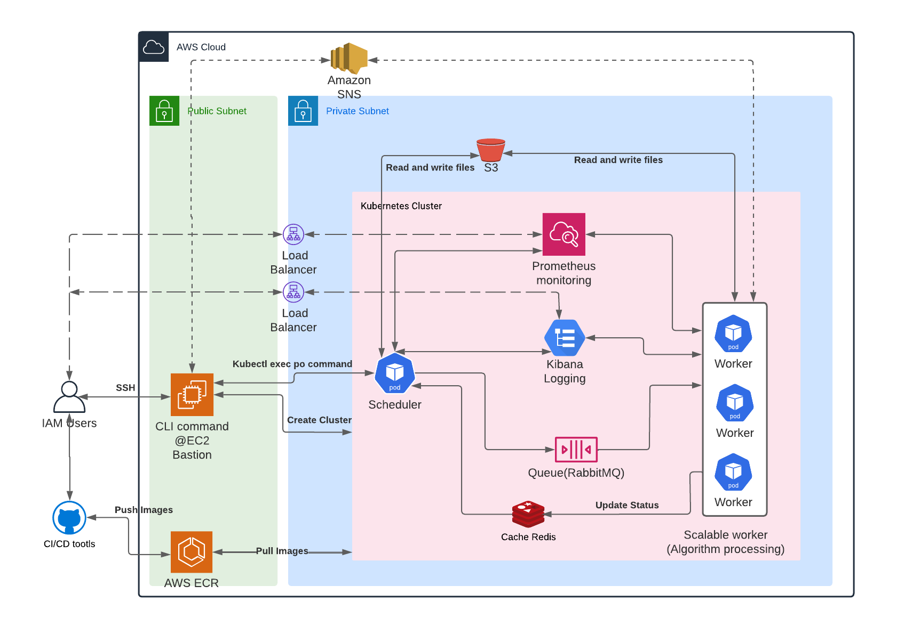

# Giamo cloud deployment command line interface 
## Description

This program implements this [Solar-data-tools](https://github.com/slacgismo/solar-data-tools) algorithm to process multiple files in parallel on AWS with multiple EC2 instances.

Goals:

- Implemented AWS cloud computation parallelly by processing multiple files with this [Solar-data-tools](https://github.com/slacgismo/solar-data-tools) algorithm.
- Read configuration setting from `config.yaml`
- Scale down the nodes number to zero after processing files to avoid extra cost.
- Save all the process results in a file on the AWS S3 bucket.
- Hosting AWS services with EKS.
- Monitoring EKS performance by [Prometheus](https://prometheus.io/) monitoring service with [Grafana](https://grafana.com/) interface.
- Tracking Log information with [kibana](https://www.elastic.co/kibana/).
## System diagram

### AWS Quick Start

1. SSH to EC2 tunnerl.

~~~
ssh -i <pem-file> ec2-user@<host-ip>
~~~

2. Modification the configuration in `./config/config.yaml` files.

3. Run process files command.

~~~
cd gismoclouddeploy/services/server/cli
make run-files [-n]
~~~

1. Check the reuslts from saved file on the AWS S3 bucket. Developers can define the save file's configuration such as `saved_bucket`, `saved__target_path` and `saved__target_filename` in `config.yaml`.
2. Check logs files.
   Developers can check the log information from `Kibana` in EKS by following Link.
   The Kiana URL: <>
3. Monitoring the services.
   Developers can monitor the kubernetes performance by unsing `Prometheus` monitoring service with `Grafana` UI in EKS by following Link.
   The Grafana URL: <>
   Username: `admin`
   Password: `prom-operation`

### Command

The make command supports the following subcommands:

- make run-files [-n]
- make help
- make version

If option command `-n` after run-files is specified, the program runs all files of the bucket that is defined in `config.yaml` file.

### Configuration files

Under `config` folder, developers can modify parametes of the project.
1). The `general` configuration contains all the environement variables setting.
2). The `file-config` configuration contains all the config setting of run multiple files.
3). The `solardata` configuration contains all the parametes of solar-data-tools algorithm.

## Local development

The AWS EKS hosts services based on the ECR images. In order to build new images to be used by Kubernetes, developers have to build and test images by docker-compose command. If the images are verified, developers can push images to ECR.
### Installation
1). Download git repository
~~~
git clone https://github.com/slacgismo/gismo-cloud-deploy.git
~~~
2). Install the dependencies
~~~
cd gismo-cloud-deploy/services/client
python3 -m venv venv
source ./venv/bin/activate
pip install -r requirements.txt
~~~
3). Developers are allowed to use `docker-compose` or `kubernetes` to manage the system
#### Using `docker-compose`
Before using docker to host local services, please install docker by following the instructions [Docker Link](https://docs.docker.com/get-docker/).
Staring docker images by command
~~~
cd gismo-cloud-deploy/gismoclouddeploy/services
docker-compose up --build
~~~

Setup AWS credentials for Kubernetes
~~~
touch ./gismo-cloud-deploy/gismoclouddeploy/services/server/.env/.dev-sample
~~~

Replace the environemnt variables inside `<xxx-xxx-xxx>`.

~~~
AWS_ACCESS_KEY_ID=<your-access-key>
AWS_SECRET_ACCESS_KEY=<your-secret-key-id>
AWS_DEFAULT_REGION=<region>
~~~
Push images to ECR
~~~
make push-server
make push-worker
~~~

#### using `kubernetes`
Before using kubernetes to host local services, please start kubernetes services and install necessary tools by following instruction [Kubernetes Link](https://kubernetes.io/docs/tasks/tools/). 

Kubernets dose not generate new images. It runs the built images by docer-compose locally or the published images on ECR.

~~~
cd gismo-cloud-deploy/gismoclouddeploy/k8s/k8s-local/
~~~

start all all services by using kubectl command

~~~
kubectl apply -f .
~~~

check if services is running by command.

~~~
kubectk get all 
~~~

Setup AWS credentials for Kubernetes.

~~~
kubectl create secret generic aws-access-key-id --from-literal  aws-access-key-id=<your AWS access key>
kubectl create secret generic aws-secret-access-key --from-literal aws-secret-access-key=<your AWS secret key>
~~~

## AWS development

### EC2 and EKS Re-deployment
1.If (ssh tunnel) bastion instance is not created, deploying bastion instance on AWS by command as below.
~~~
cd deploy
make tf-init
make tf-plan
make tf-apply
~~~

2. If (ssh tunnel) is created and running, SSH to bastion.

~~~
ssh -i <pem-file> ec2-user@<host-ip>
~~~

3. Download git repository in Bastion instance

~~~
cd /usr/src/app
git clone https://github.com/slacgismo/gismo-cloud-deploy.git
cd gismo-cloud-deploy
~~~

4. CLI installation

Create virtual environment, and install dependencies by following command.

~~~
cd gismoclouddeploy/services/server/cli
make setup-ec2-env
~~~

5. Check EKS status. If EKS was not created, create EKS.

Check EKS status
~~~
cd gismoclouddeploy/services/server/cli
make list-eks
~~~

Create EKS

~~~
cd gismoclouddeploy/services/server/cli
make create-eks [--name EKSNAME]
~~~

Scale the nodes.

~~~
cd gismoclouddeploy/services/server/cli
make scale [--nodes NODESNUMBER]
~~~

6. Apply kubernetes configuration file

~~~
cd gismoclouddeploy/services/server/cli
make apply 
~~~

7. Check all services status

~~~
cd gismoclouddeploy/services/server/cli
make get-all 
~~~

8. If all services are running, process files by command:

~~~
cd gismoclouddeploy/services/server/cli
make run-files [-n]
~~~
9. Delete EKS

~~~
cd gismoclouddeploy/services/server/cli
make delete-eks [--name EKSNAME]
~~~
